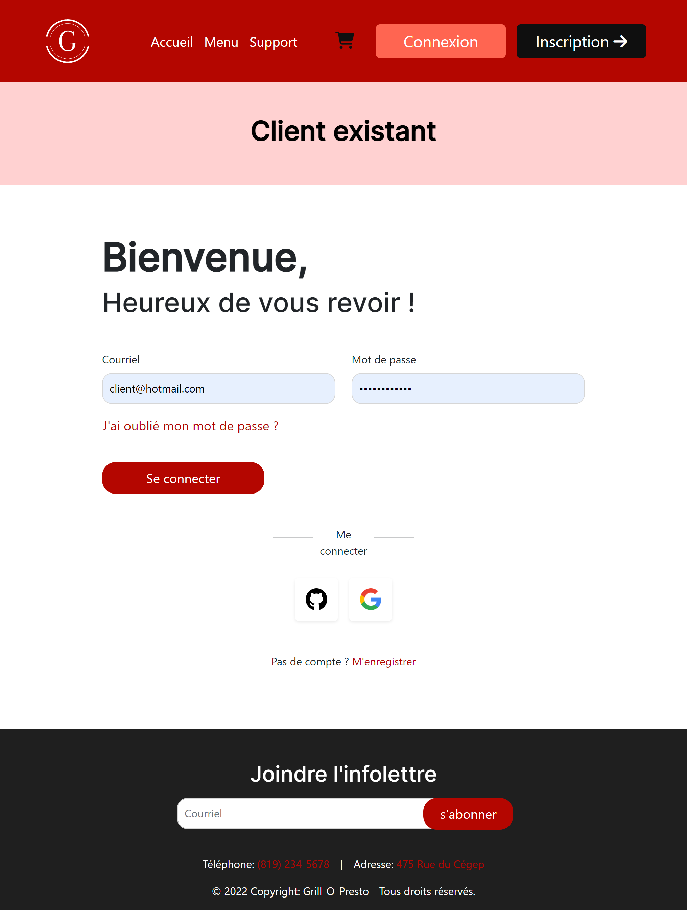
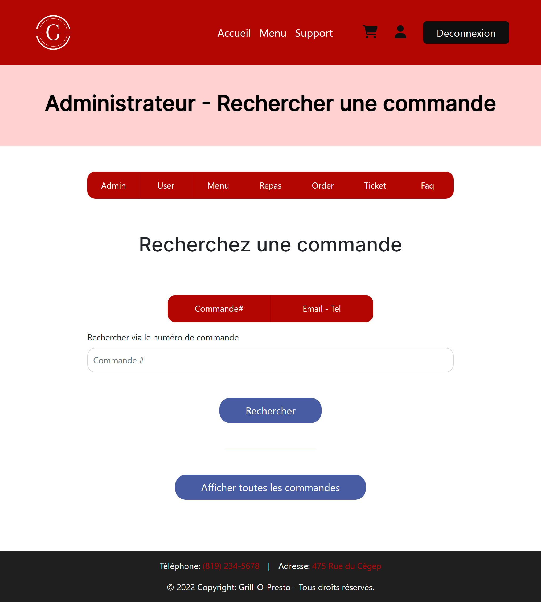

Ceci est un restaurant fictif que j'ai créé avec trois autres collègues. Il dispose de plusieurs pages :

Client :

Accueil, commandes, tickets, FAQ, etc.

Admin :

Gestion utilisateurs, gestion administrateur, gestion des tickets, gestion de la FAQ, création des menus et des repas, etc.

### Accueil

### Connexion

### Inscription

### Commandes

<!-- DO NOT USE FOR COMMERCIAL PURPOSES.
© 2022 GRILL-O-PRESTO DEVELOPERS -->
